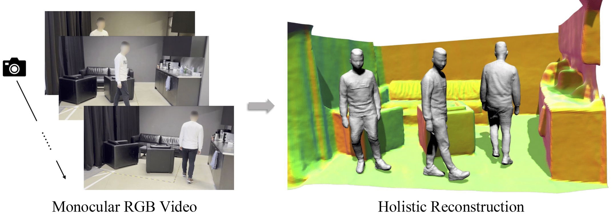

<p align="center">
  <h1 align="center">HSR: Holistic 3D Human-Scene<br>Reconstruction from Monocular Videos</h1>
  <p align="center">
    <a href="https://lxxue.github.io">Lixin&nbsp;Xue</a>
    ·
    <a href="https://ait.ethz.ch/people/cheguo">Chen&nbsp;Guo</a>
    ·
    <a href="https://chengwei-zheng.github.io/">Chengwei&nbsp;Zheng</a>
    ·
    <a href="https://fangjinhuawang.github.io/">Fangjinhua&nbsp;Wang</a>
    ·
    <a href="https://tianjian.me/">Tianjian&nbsp;Jiang</a>
    <br>
    <a href="https://azuxmioy.github.io/">Hsuan-I&nbsp;Ho</a>
    ·
    <a href="https://ait.ethz.ch/people/kamanuel">Manuel&nbsp;Kaufmann</a>
    ·
    <a href="https://ait.ethz.ch/people/song">Jie&nbsp;Song</a>
    ·
    <a href="https://ait.ethz.ch/people/hilliges">Otmar&nbsp;Hilliges</a>
  </p>
  <h2 align="center">
    <p>ECCV 2024</p>
    <a href="https://files.ait.ethz.ch/projects/hsr/hsr_paper_main.pdf">Paper</a>
    | <a href="https://lxxue.github.io/human-scene-recon/">Project Page</a>
    | <a href="https://www.youtube.com/watch?v=SIT4ErJpDZA&ab_channel=AITETH">Video</a>
  </h2>
  <p align="center">
    <a href="https://github.com/lxxue/HSR"></a>
    <br>
    <em>HSR jointly reconstructs dynamic humans and static scenes from monocular RGB videos.</em>
  </p>
</p>

## Getting Started

### Environment Setup

The codebase is tested with Ubuntu 22.04, CUDA 12.1 and PyTorch 2.1.1. Other versions should also work fine.

```bash
git clone https://github.com/lxxue/HSR.git && cd HSR
conda create -n hsr python=3.10.4
conda activate hsr
# install torch
pip install torch==2.1.1 torchvision==0.16.1 --index-url https://download.pytorch.org/whl/cu121
# install prebuilt binaries for pytorch3d and kaolin
pip install fvcore==0.1.5.post20221221 iopath==0.1.10
pip install --no-index --no-cache-dir pytorch3d -f https://dl.fbaipublicfiles.com/pytorch3d/packaging/wheels/py310_cu121_pyt211/download.html
pip install kaolin==0.15.0 -f https://nvidia-kaolin.s3.us-east-2.amazonaws.com/torch-2.1.1_cu121.html
# install other dependencies and build custom ops
pip install cython==3.0.11
pip install -e .
```

### Data Preparation

Download [SMPL model](https://smpl.is.tue.mpg.de/download.php) (version 1.1.0 for Python 2.7 (female/male/neutral)) and move them to the corresponding places:
```bash
mkdir -p hsr/checkpoints/smpl_body_models
mv /path_to_smpl_models/basicmodel_f_lbs_10_207_0_v1.1.0.pkl hsr/checkpoints/smpl_body_models/SMPL_FEMALE.pkl
mv /path_to_smpl_models/basicmodel_m_lbs_10_207_0_v1.1.0.pkl hsr/checkpoints/smpl_body_models/SMPL_MALE.pkl
mv /path_to_smpl_models/basicmodel_neutral_lbs_10_207_0_v1.1.0.pkl hsr/checkpoints/smpl_body_models/SMPL_NEUTRAL.pkl
```
Download preprocessed demo data and put them under data folder:
```bash
wget https://files.ait.ethz.ch/projects/hsr/real.zip
unzip real.zip -d data
rm real.zip
```
Configure paths in `hsr/confs/base.yaml`
```yaml
data_root: /path_to_HSR/data
result_root: /path_to_HSR/result
```

## Running the Demo

Navigate to the [hsr](hsr/) folder and run the script for training and rendering on the demo data:

```
cd hsr
bash cmd.sh
```

You can continue training or only render all frames by uncommenting the corresponding lines in [cmd.sh](hsr/cmd.sh):
```bash
# extra_args="model.is_continue=True"
# extra_args="test_only=True"
```

## TODOs

We will gradually complete the codebase and provide more detailed instructions.

- [ ] Code release for preprocessing custom data (Expected: End of December)
- [ ] Release of NeuMan dataset checkpoints for benchmarking (Expected: Mid-January)

## Acknowledgements

We use code from other research projects, including [Vid2Avatar](https://github.com/MoyGcc/vid2avatar), [MonoSDF](https://github.com/autonomousvision/monosdf), and [NeuMan](https://github.com/apple/ml-neuman). We sincerely thank the authors for their awesome work! 

## Citation

Please consider citing our work if you find our research useful for your work:

```bibtex
@inproceedings{xue2024hsr,
    author={Xue, Lixin and Guo, Chen and Zheng, Chengwei and Wang, Fangjinhua and Jiang, Tianjian and Ho, Hsuan-I and Kaufmann, Manuel and Song, Jie and Hilliges Otmar},
    title={{HSR:} Holistic 3D Human-Scene Reconstruction from Monocular Videos},
    booktitle={European Conference on Computer Vision (ECCV)},
    year={2024}
}
```